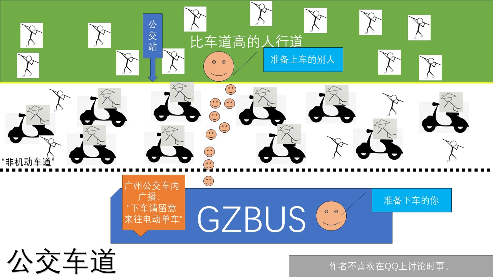

# GZTrafficState
The state of Guangzhou traffic. 广州交通现状图示。

The state of Guangzhou traffic illustrated by an image made using Microsoft PowerPoint.

# Why? 为什么要做这张图？

Right now all I can say is that it's directly inspired by a [video](https://www.bilibili.com/video/BV1JX4y1H7Au) and my personal experiences walking on the streets.

目前我能说的就是我创作这张图片是受到了[这部影片](https://www.bilibili.com/video/BV1JX4y1H7Au)以及本人在路上行走经历的启发。仅作现状描述，无意表达任何个人见解。

# Licensing 版权声明

GPL v3 is used wherever applicable.

在一切适用的情况下使用 GPL v3 许可。